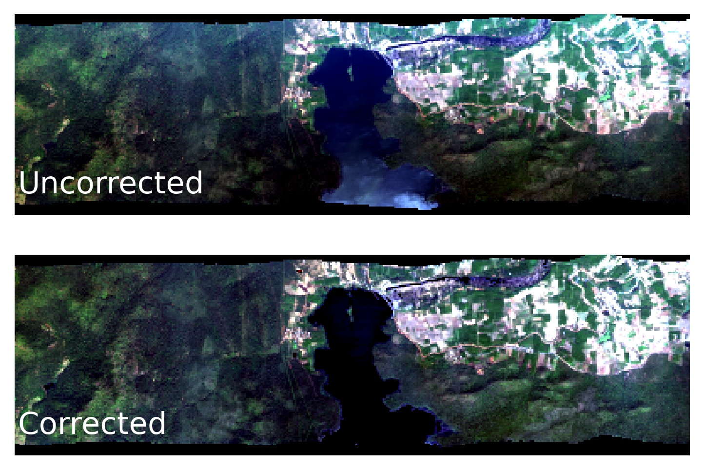

# SISTER Reflectance Correction PGE Documentation

## Description

The L2A reflectance correction PGE applies topographic, BRDF and glint corrections to surface reflectance data. 
Topographic correction is performed using the Sun-Canopy-Sensor+C algorithm (Soenen et al. 2005), BRDF correction is 
performed using the FlexBRDF algorithm (Queally et al. 2022) and glint correction is performed using the method of Gao 
and Li (2021). Because of narrow fields of view BRDF correction is not applied to PRISMA or DESIS images.



### References

 - Gao, B. C., & Li, R. R. (2021). Correction of Sunglint Effects in High Spatial Resolution Hyperspectral Imagery Using SWIR or NIR Bands and Taking Account of Spectral Variation of Refractive Index of Water. Advances in Environmental and Engineering Research, 2(3), 1-15.
 - Queally, N., Ye, Z., Zheng, T., Chlus, A., Schneider, F., Pavlick, R. P., & Townsend, P. A. (2022). FlexBRDF: A flexible BRDF correction for grouped processing of airborne imaging spectroscopy flightlines. Journal of Geophysical Research: Biogeosciences, 127(1), e2021JG006622.
 - Soenen, S. A., Peddle, D. R., & Coburn, C. A. (2005). SCS+ C: A modified sun-canopy-sensor topographic correction in forested terrain. IEEE Transactions on geoscience and remote sensing, 43(9), 2148-2159.

## PGE Arguments

The L2A reflectance correction PGE  takes the following argument(s):

| Argument            | Description                          | Default |
|---------------------|--------------------------------------|---------|
| observation_dataset | L1B observation dataset              | -       |
| reflectance_dataset | L2A reflectance dataset              | -       |
| crid                | Composite release identifier         | '000'   |
| experimental        | Designates outputs as "experimental" | 'True'  |

## Outputs

The outputs of the L2A reflectance correction PGE use the following naming convention:

    (EXPERIMENTAL-)SISTER_<SENSOR>_L2A_CORFL_<YYYYMMDDTHHMMSS>_<CRID>

Note that the "EXPERIMENTAL-" prefix is optional and is only added when the "experimental" flag is set to True.

The following data products are produced:

| Product description                             | Units | Example filename                                              |
|-------------------------------------------------|-------|---------------------------------------------------------------|
| ENVI corrected reflectance datacube             | %     | SISTER\_AVCL\_L2A\_CORFL\_20110513T175417\_000.bin            |
| ENVI corrected reflectance header file          | -     | SISTER\_AVCL\_L2A\_CORFL\_20110513T175417\_000.hdr            |
| Corrected reflectance metadata (STAC formatted) | -     | SISTER\_AVCL\_L2A\_CORFL\_20110513T175417\_000.json           |
| False color reflectance quicklook               | -     | SISTER\_AVCL\_L2A\_CORFL\_20110513T175417\_000.png            |
| PGE runconfig                                   | -     | SISTER\_AVCL\_L2A\_CORFL\_20110513T175417\_000.runconfig.json |
| PGE log                                         | -     | SISTER\_AVCL\_L2A\_CORFL\_20110513T175417\_000.log            |

Metadata files are [STAC formatted](https://stacspec.org/en) and compatible with tools in the [STAC ecosystem](https://stacindex.org/ecosystem).

## Executing the Algorithm

This algorithm requires [Anaconda Python](https://www.anaconda.com/download)

To install and run the code, first clone the repository and execute the install script:

    git clone https://github.com/sister-jpl/sister-reflect_correct.git
    cd sister-reflect_correct
    ./install.sh
    cd ..

Then, create a working directory and enter it:

    mkdir WORK_DIR
    cd WORK_DIR

Copy input files to the work directory. For each "dataset" input, create a folder with the dataset name, then download 
the data file(s) and STAC JSON file into the folder.  For example, the reflectance dataset input would look like this:

    WORK_DIR/SISTER_AVCL_L2A_RSRFL_20110513T175417_000/SISTER_AVCL_L2A_RSRFL_20110513T175417_000.bin
    WORK_DIR/SISTER_AVCL_L2A_RSRFL_20110513T175417_000/SISTER_AVCL_L2A_RSRFL_20110513T175417_000.hdr
    WORK_DIR/SISTER_AVCL_L2A_RSRFL_20110513T175417_000/SISTER_AVCL_L2A_RSRFL_20110513T175417_000.json

Finally, run the code 

    ../sister-reflect_correct/pge_run.sh --reflectance_dataset SISTER_AVCL_L2A_RSRFL_20110513T175417_000 --observation_dataset SISTER_AVCL_L1B_RDN_20110513T175417_000_OBS

